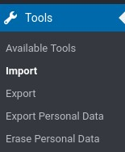
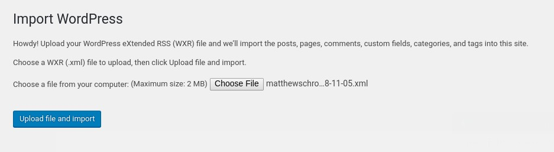
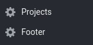
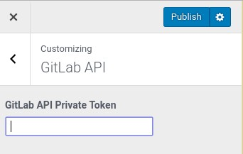

## Matthew Schroeter Website

This is my personal website built on WordPress. It uses the chart.js JavaScript library and integrates with GitLab to get my total number of commits.

### Set Up Locally

There are a million ways to set up WordPress locally. I'm not going to take the time to write them all down, but I'll give you some links to some guides you can use.

* [Windows (XAMPP)](https://themeisle.com/blog/install-xampp-and-wordpress-locally/)
* [Mac OS (MAMP)](https://skillcrush.com/2015/04/14/install-wordpress-mac/)
* [Linux (Ubuntu)](https://www.tecmint.com/install-wordpress-on-ubuntu-16-04-with-lamp/)

*Alternative methods that are slightly more advanced and mostly platform agnostic*

* [Vagrant (VVV)](https://premium.wpmudev.org/blog/vvv-wordpress-development/)
* [Docker](https://www.hostinger.com/tutorials/run-docker-wordpress)
* [Devilbox (Uses Docker)](https://deliciousbrains.com/devilbox-local-wordpress-development-docker/) - My personal favorite

### Install This Repository

You won't get away with just copying the theme I've created into your WordPress install as I'm also using some plugins that are required. After you have your environment set up following the directions listed above, follow these steps to get this site installed:

* Go to your environments public directory and clone this repository
    * `git clone https://github.com/sincspecv/ms-website.git`
* [Download WordPress](https://wordpress.org/download/) and copy all files except for the `wp-content` folder into your working directory and set up your wp-config file
* Import the post data
    * On your WP Admin screen, select Tools>Import
    
    
    * Install and run the WordPress Import Tool
    
    
    * Select the file `matthewschroeter.wordpress.xml` and run the importer
    
    
* Images in the media library won't be in the database, so you'll have to re-upload them. Just drag and drop all of them into the media library.

    
* Set up projects and footer data

    
* Add your GitLab API Key to the customizer
    * On you WP Admin screen select Appearance>Customize
    * Select `GitLab API`
    * Enter your key
    
    
    
Now you should be all set up and the site should be working
